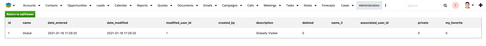

# sqlViewer v1.0

This allows you to recombine a query from your SugarCRM log file into a readable query

You will find the sqlViewer tool on your Admin Menu in the 'System' section

When you click on that link it will take you to the maion screen. Here you can either paste in a query that you want to
work with or click on the 'Retrieve SQL from Log' button.

If you click the 'Retrieve SQL from Log' button you will get a listing of every unique SQL query in your sugarcrm.log
file. Next to the button on the main screen you are able to set a limit to how many lines the tool shows you. They are
sorted Newest to oldest.

Once you paste a query or select one from the log you will then see that query formatted, highlighted, and the params
moved into place.

You can click on the 'Submit and Run Query' button to actually run the query against your database. The tool only runs
SELECT queries and will refuse to run an UPDATE, DELETE or other type of query.

